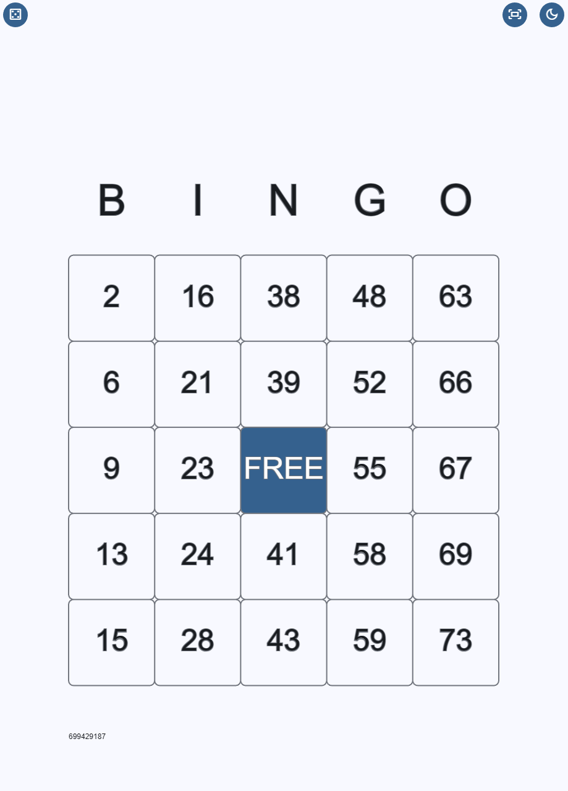

Below is a complete **`README.md`** you can drop straight into your GitHub repo.
It’s written for GitHub Pages, p5.js **2.0**, includes credits/disclaimers, and a QR code for mobile access.

---

# 🎱 Bingo Card – p5.js Web App

A responsive, interactive **Bingo Card** web application built with **p5.js 2.0**.
The app works on desktop and mobile browsers, supports light/dark themes, persists state using `localStorage`, and generates reproducible bingo cards using a random seed.

👉 **Live demo (GitHub Pages):**
[https://dariuszlabaj.github.io/BingoCard/](https://dariuszlabaj.github.io/BingoCard/)

---

## ✨ Features

* 🎲 Randomly generated **BINGO cards** (B–I–N–G–O ranges)
* ♻️ **Persistent state** (card, seed, preferences) via `localStorage`
* 🌗 **Light / Dark theme** toggle (system-aware)
* 📱 **Mobile-friendly** (touch support, fullscreen toggle)
* 🔊 Subtle **sound effects** for interactions
* 🌍 **Internationalization (i18n)** with automatic language detection
* 🎨 Material Symbols icons rendered via font
* ⚡ Built with **p5.js 2.0**

---

## 📸 Preview



---

## 📱 Open on Mobile (QR Code)

Scan this QR code to open the app on your phone:


🔗 **Direct link:**
[https://dariuszlabaj.github.io/BingoCard/](https://dariuszlabaj.github.io/BingoCard/)

---

## 🛠️ Tech Stack

* **JavaScript**
* **p5.js 2.0**
* **HTML / CSS**
* **GitHub Pages** (hosting)

---

## 🧠 How It Works (High Level)

* `script.js`

  * App lifecycle (`setup`, `draw`)
  * Loading screen with progress bar
  * Asset loading (fonts, sounds, localization)
* `bingoCard.js`

  * Core Bingo logic
  * Card generation using seeded randomness
  * UI interaction handling (touch/mouse)
  * Rendering and transitions
* `resourceManager.js`

  * Language resolution based on browser locale
  * String formatting and fallback handling

---

## 💾 Persistence

The app stores the following data in `localStorage`:

* Bingo card values & checked states
* Random seed (for reproducibility)
* User preferences:

  * Theme (light/dark)
  * Notifications (future-ready)

Storage key:

```
userData
```

---

## 🔊 Sound Effects Disclaimer

This project uses a sound effect from **Freesound**:

* **Sound:** UI toggle sound
* **Author:** radwoc
* **Source:** [https://freesound.org/people/radwoc/sounds/256759/](https://freesound.org/people/radwoc/sounds/256759/)
* **License:** As specified on Freesound.org

The sound is used for non-commercial, UI feedback purposes only.

---

## 🔤 Fonts & Icons Disclaimer

This project uses external fonts and icon resources:

### Google Fonts

* **Bricolage Grotesque**
* Loaded via Google Fonts CDN
* © Google Fonts, used under their respective licenses

### Material Symbols

* **Material Symbols Outlined**
* Provided by Google
* Used as a font-based icon set

All fonts and icons remain the property of their respective owners and are used in accordance with their licenses.

---

## 📄 License

This project is provided for educational and personal use.

If you plan to reuse or modify it:

* Keep attribution notices intact
* Respect third-party asset licenses (fonts, icons, sounds)

---
